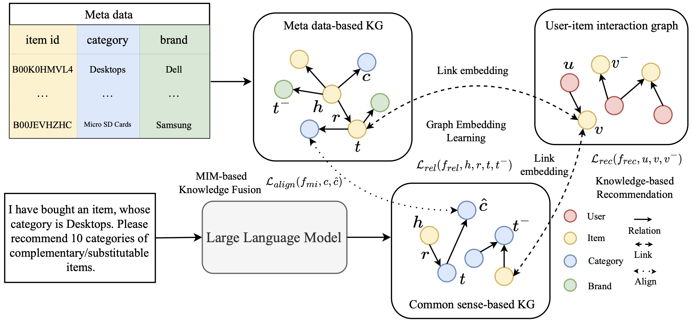

# CSRec
This is the official implementation for *Common Sense Enhanced Knowledge-based Recommendation with Large Language Model*

<div align=center>

</div>


## Requirements

```
python==3.7.12
recbole==1.0.1
torch==1.13.1
cudatoolkit==11.3.1
```

## Getting Started

1. Clone the repository and install requirements

```bash
git clone https://github.com/ysh-1998/CSRec.git
```
2. Download data from [Google Drive](https://drive.google.com/drive/folders/1p5tSEtl8YlsMeliG6zdr9n60a6vbKH4M?usp=sharing) and put it in the `dataset` folder.
3. Run model on the build-in dataset
```bash
# Electronics
python run_csrec.py --gpu_id=0 --model="CKE" --cs_kg_name="coms" --dataset="Electronics"
python run_base.py --gpu_id=0 --model="CKE" --kg_name="coms" --dataset="Electronics"
# Office
python run_csrec.py --gpu_id=0 --model="CKE" --cs_kg_name="coms" --dataset="Office"
python run_base.py --gpu_id=0 --model="CKE" --kg_name="coms" --dataset="Office"
```